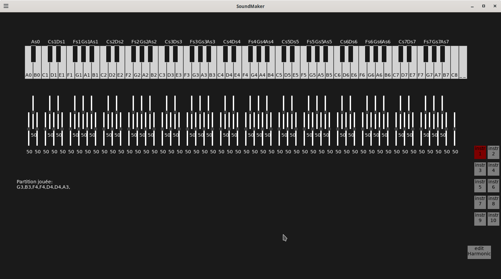
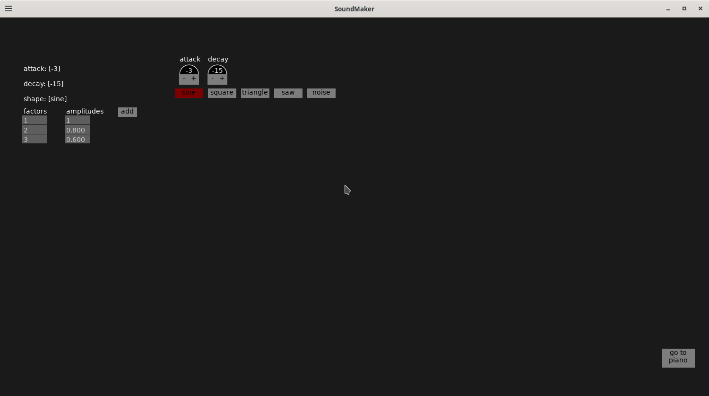

# 🎹 SoundMaker

Created by **Jojopov**
License: [GNU GPL v3](https://www.gnu.org/licenses/gpl-3.0.html)  
2025

**SoundMaker** is a small interactive synthesizer developed in Love2D.
It allows you to play notes on a virtual keyboard, modify their sound parameters, and even record/replay melodies.

## ✨ Features

- 🎹 Virtual keyboard (white & black keys, rest key).

- 🎚️ Adjustment sliders to change note frequencies.

- 🔊 Waveform selection (square, sine, etc.).

- 📝 Recordable score → replay your melodies.

- 🎶 Visual highlighting of played notes.

## 🛠 Materials required

- Any code editor
- Linux or **Windows Vista and later**
- Love2D (for development or running the .love file)

### 🚀 Installation

- Install Love2D.

- Clone the repository:

<code> git clone https://github.com/FranzBonaparta/SoundMaker.git
cd SoundMaker
love .</code>

- 🎉 Play some music!

### 📦 Build & Deployment (Linux / Windows / Mac)

Make sure you have [Love2D 11.5](https://love2d.org/) installed.

If you're on Linux
<code>love .</code>
For Windows, run the build.sh script or follow the commands listed there, then run the .exe!