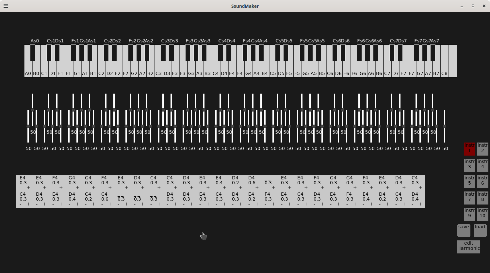
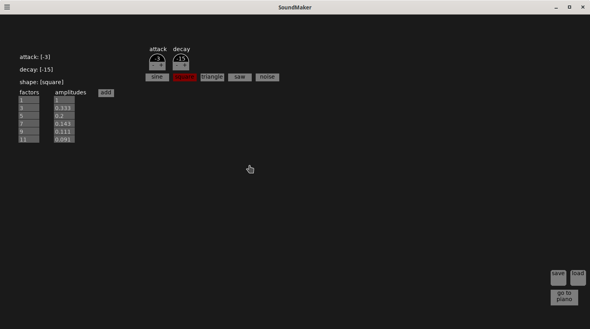
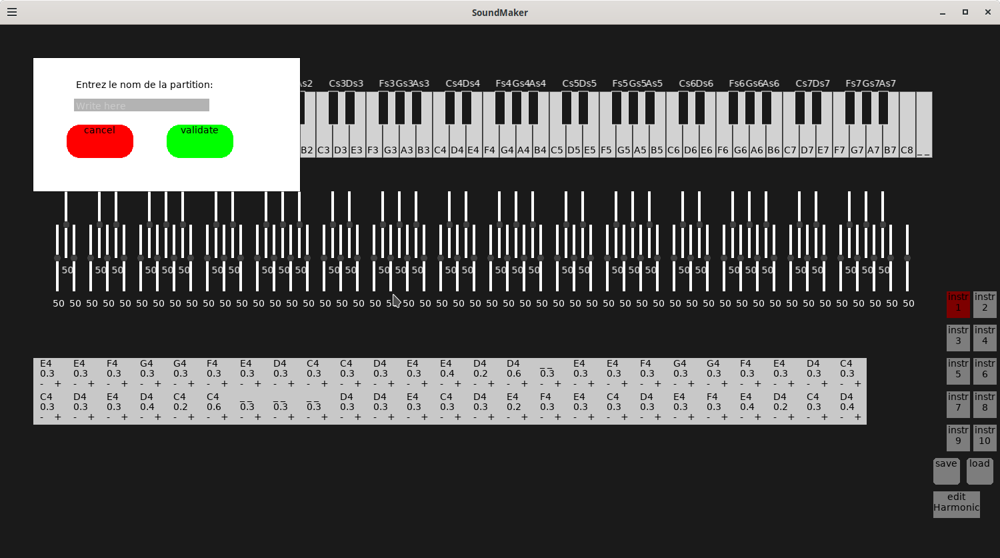
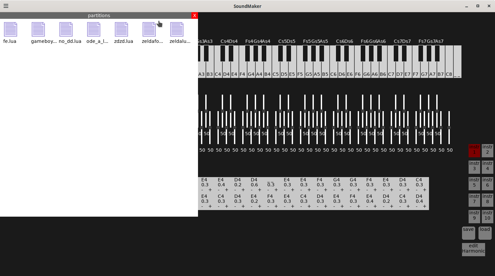

# 🎹 SoundMaker

Created by **Jojopov**

2025

## 📷 Screenshots

  
  
    
  

**SoundMaker** is a small interactive synthesizer developed in Love2D.
It allows you to play notes on a virtual keyboard, modify their sound parameters, and even record/replay melodies.

## 📦 Last updates

- Implementation of note's button on partition which allowed you to edit eaxh note's duration.
- Load and Save function for instrument and partition.

## ✨ Features

- 🎹 Virtual keyboard (white & black keys, rest key).

- 🎚️ Adjustment sliders to change note frequencies.

- 🔊 Waveform selection (square, sine, etc.).

- 📝 Recordable score → replay your melodies and edit all note's played duration.

- 🎶 Visual highlighting of played notes.

## Keys

🎹 Piano Controls:

- **Left Click** – Play a black note
- **Middle Click** – Play a white note
- **Right Click** – Play a quaver (shorter note)

📝 Partition Controls:

- **Tab** – Play the current partition
- **Delete** – Clear the entire partition
- **Backspace** – Remove the last note from the partition
- **Right Click** - On each note ("+" or "-" button) from the partition to edit the note's duration

🎧 Programmatic Sounds:

- **space**, **a**, **z**, **e**, **r**, **t**, **y**, **1**, **2**, **3** – Trigger custom or synthesized sounds

## 🛠 Materials required

- Any code editor
- Linux or **Windows Vista and later**
- Love2D (for development or running the .love file)

### 🚀 Installation

- Install Love2D.

- Clone the repository:

<code> git clone https://github.com/FranzBonaparta/SoundMaker.git
cd SoundMaker
love .</code>

- One zip file, for windows is available

- 🎉 Play some music!

### 📦 Build & Deployment (Linux / Windows / Mac)

Make sure you have [Love2D 11.5](https://love2d.org/) installed.

If you're on Linux
<code>love .</code>
For Windows, download the official zipped 32 or 64 bit executable (not the installer) from https://www.love2d.org/ and copy it to a new folder tools/love-11.5-win32/
 run the build.sh script or follow the commands listed there, then run the .exe!